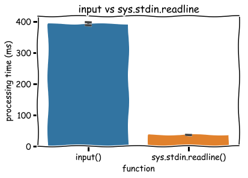

# 入出力

## 標準入力での実行方法

ファイルから標準入力を受け取る

```sh
python main.py < input.txt
```

```sh
cat input.txt | python main.py
```

## よく使う標準入力

### 文字列

```text
string
```

```py
S = input()
```

### 数字

```text
1
```

```py
N = int(input())
```

### 複数の数字

#### 別々の変数

```text
10 5
```

```py
N, K = map(int, input().split())
```

#### 1つの変数（リスト）

```text
1 2 3 4 5
```

```py
A = [int(x) for x in input().split()]
```

```py
A = list(map(int, input().split()))
```

### 複数行の文字列

```text
#..#
..##
```

```py
S = [list(input()) for _ in range(H)]
```

!!! Example

    ```py
    >>> print(S)
    [['#', '.', '.', '#'], ['.', '.', '#', '#']]
    ```

### 複数行の数字

```text
1
2
3
```

```py
A = [int(input()) for _ in range(N)]
```

### 複数行に複数の数字

```text
1 4
2 5
3 6
```

#### 1つの2次元リスト

```py
A = [[int(x) for x in input().split()] for _ in range(H)]
```

!!! Example

    ```py
    >>> print(A)
    [[1, 4], [2, 5], [3, 6]]
    ```

#### 別々の1次元リスト

```py
a, b = [None] * N, [None] * N
for i in range(N):
    a[i], b[i] = map(int, input().split())
```

!!! Example

    ```py
    >>> print(a)
    [1, 2, 3]
    >>> print(b)
    [4, 5, 6]
    ```

## 標準入力の高速化

```py
import sys
input = sys.stdin.readline
```

!!! Note
    10倍以上高速化できるので、$10^6$ を超える場合は使うこと

### 処理速度の比較

データ数が$10^6$のときの処理速度



出展: [Pythonの知っておくと良い細かい処理速度の違い8個](https://www.kumilog.net/entry/python-speed-comp#input-%E3%81%A8-sysstdinreadline)

## リストの出力

リストを空白区切りや改行区切りで出力する際、アンパックを用いると簡単に出力できる

```py
print(*a)
```

!!! Example

    ```py
    >>> a = [1, 2, 3]
    >>> print(*a)
    1 2 3
    >>> print(*a, sep="\n")
    1
    2
    3
    ```
